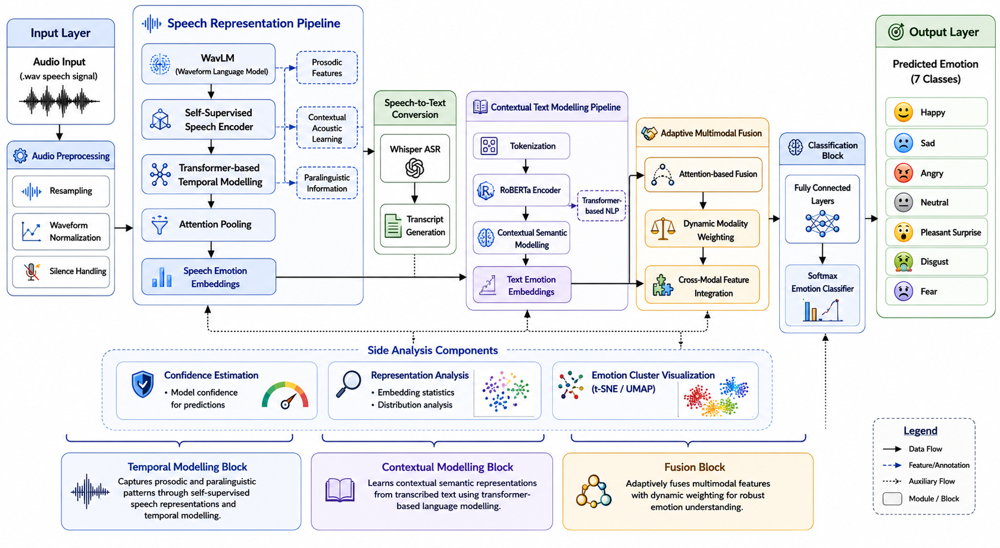

# Kanjo Kenshutsu

### Decoding Human Emotion through Adaptive Multimodal Intelligence

---

---

## System Architecture

---

## Overview

Kanjo Kenshutsu is an adaptive multimodal emotion recognition framework that integrates self-supervised speech representation learning with contextual text modelling for robust emotion classification.

The system combines:

* WavLM-based speech embeddings
* RoBERTa-based contextual text embeddings
* Adaptive gated multimodal fusion
* Transformer-based temporal and contextual modelling

to analyze and classify human emotions from speech and textual information.

The framework was experimentally evaluated on the TESS (Toronto Emotional Speech Set) dataset under:

* Speech-only
* Text-only
* Multimodal fusion

configurations to study modality contribution and adaptive fusion behavior.

---

## Key Features

* Self-supervised speech representation learning using WavLM
* Contextual semantic modelling using RoBERTa
* Adaptive gated multimodal fusion
* Transformer-based temporal modelling
* Emotion-wise classification analysis
* Fusion gate interpretability
* Representation separability analysis using t-SNE / UMAP
* Error analysis and modality informativeness study

---

## Architecture Overview

The framework consists of three major pipelines:

### 1. Speech Processing Pipeline

* Audio preprocessing
* WavLM speech encoder
* Transformer temporal modelling
* Attention pooling
* Speech emotion embeddings

### 2. Text Processing Pipeline

* Whisper ASR transcription
* Tokenization and preprocessing
* RoBERTa contextual encoder
* Contextual semantic embeddings

### 3. Adaptive Fusion Pipeline

* Dynamic modality weighting
* Attention-based multimodal fusion
* Fully connected classifier
* Softmax emotion prediction

---

## Technologies Used

| Category                | Technologies              |
| ----------------------- | ------------------------- |
| Deep Learning Framework | PyTorch                   |
| Speech Encoder          | WavLM                     |
| Text Encoder            | RoBERTa                   |
| ASR Model               | Whisper                   |
| NLP Library             | Hugging Face Transformers |
| Audio Processing        | Librosa, Torchaudio       |
| Visualization           | Matplotlib, UMAP, t-SNE   |
| GPU Support             | CUDA                      |

---

## Dataset

### Toronto Emotional Speech Set (TESS)

* 7 emotion classes
* 2800 audio samples
* Studio-quality emotional speech recordings
* English speech dataset

Emotion Classes:

* Angry
* Disgust
* Fear
* Happy
* Neutral
* Pleasant Surprise
* Sad

---

## Experimental Results

| Model             | Validation Accuracy | Validation Macro F1 |
| ----------------- | ------------------- | ------------------- |
| Speech-Only       | 99.29%              | 99.29%              |
| Text-Only         | 14.29%              | 3.57%               |
| Multimodal Fusion | 99.29%              | 99.29%              |

---

## Key Scientific Findings

- The proposed WavLM-based speech pipeline achieved near-perfect performance on the TESS dataset with 99.29% validation accuracy and 99.29% macro F1-score, demonstrating strong acoustic emotion separability.

- The text-only RoBERTa pipeline collapsed to near-random prediction behavior with 14.29% validation accuracy and 3.57% macro F1-score, indicating that TESS transcripts lacked sufficient semantic emotional richness for standalone text-based emotion recognition.

- Confusion matrix analysis revealed complete dominant-class prediction collapse in the text-only model, showing that the textual representations failed to learn meaningful emotion-discriminative semantic features.

- Adaptive gated multimodal fusion autonomously learned speech-dominant behavior and consistently prioritized acoustic representations during emotion classification.

- Fusion gate analysis showed approximately:
  - ~81% Speech Contribution
  - ~19% Text Contribution

- Multimodal fusion performance remained nearly identical to the speech-only architecture, indicating that emotional information within TESS is overwhelmingly encoded through acoustic and prosodic speech characteristics.

- Representation-level analysis using t-SNE / UMAP visualizations demonstrated that:
  - speech embeddings formed highly separable emotional clusters,
  - text embeddings exhibited severe overlap and weak semantic separability,
  - and fusion embeddings closely resembled speech embedding distributions.

- The experiments validate that multimodal emotion recognition systems should not assume equal modality contribution and highlight the importance of adaptive modality weighting and modality informativeness analysis.

- An important experimental limitation is that stratified random train-validation splitting introduced speaker overlap between training and validation sets, which may inflate absolute performance metrics due to speaker-specific acoustic pattern learning and speaker leakage.

---

## Future Scope

* Multilingual and accent-aware emotion recognition
* Real-time streaming inference
* Cross-corpus generalization
* Additional modalities such as facial expressions and video
* Explainable AI integration
* Lightweight deployment optimization

---

## References

1. WavLM: Large-Scale Self-Supervised Pre-Training for Full Stack Speech Processing
2. RoBERTa: A Robustly Optimized BERT Pretraining Approach
3. wav2vec 2.0: A Framework for Self-Supervised Learning of Speech Representations
4. Multimodal Fusion for Speech-Text Emotion Recognition
5. M4SER: Multimodal Multi-representation Multitask and Multistrategy Learning for SER

---

## Author

**Kushal Manikonda**  
Department of Information Technology  
Vasavi College of Engineering  
Hyderabad, India
